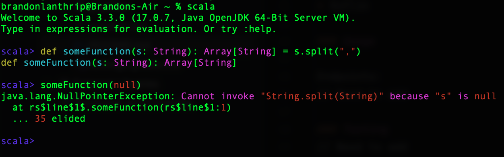
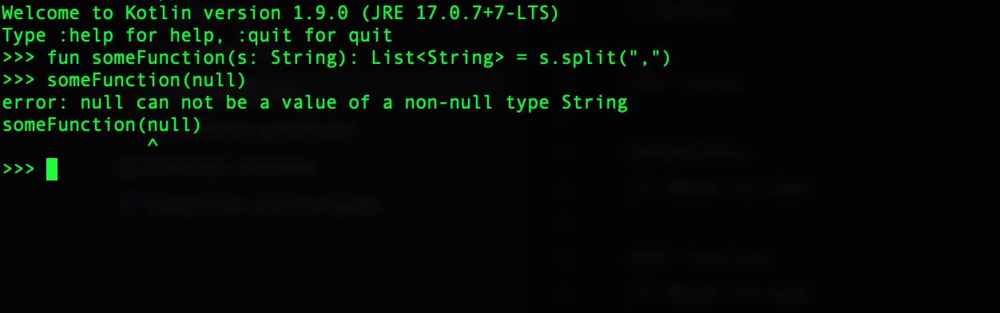

# Loan Stats Service

This application provides an endpoint for bulk loading a csv into memory and GraphQL endpoints for querying said data 

### Prerequisites

The following will need to be installed:

* Java 17
* Gradle
* Kotlin

### Usage

Endpoints:

// Need to add

### Testing
// Need to add

### Stack

#### Spring
I'm not really a big fan of Spring, or at least projects build by people who would consider themselves a "Spring Developer" before they would consider themselves a "Java Developer".
With that being said, it is a solid DI framework, and things like Spring Web, GraphQL, and JPA allow you to get off the ground running quick, and as long as you avoid reflection traps
(inject your singletons through a defined constructor and Spring by default will not "reflect" the reference into the object) it is a solid framework for building straightforward microservices.
I would generally prefer Micronaut to Spring-Boot, but for the purposes of this code project I wanted to use something I am more familiar with, and I haven't worked with Micronaut since I was at 
Target, but I did find it a lot nicer to work with overall.

#### Kotlin
I'm going to go ahead and put a mic drop here:



Here is one of my main arguments for why Kotlin is a fantastic JVM language, and in my opinion the #1 on the JVM. There is a concept of a *nullable* type. If I define a function as
taking a `String`, then it must always take a `String`. It is a proper compiler error to either pass `null` or even pass a nullable type (defined in Kotlin as `String?`). This is the tip of 
the iceberg when it comes to artful ways the kotlin developers have come up with to express your intent in a concise way.

```kotlin
// Is this a string or null? You can tell pretty quickly that you must handle it
fun someTerribleNullableMethod(s: String): String? = when {
        s.contains("a") -> ""
        else -> null
}

// Don't want to handle it? That's fine, but now you need to take a page out of Rust's book (panic!)
val npe = someTerribleNullableMethod("n")!!.length
```

Oh, you want all that functional goodness like Either, Ior, monads, proper Optionals, and partial functions? Well thanks to Kotlin's fantastic extension functions you have:

https://arrow-kt.io

I would recommend anyone who has ever read the Scala "red book" to give the "orange book" a whirl: https://www.manning.com/books/functional-programming-in-kotlin

#### GraphQL
I think that the graphQL stuff in Spring-Boot is pretty solid, and I found the longest part of this exercise to be just modeling the data. After that though it is fairly trivial to 
whip together some solid queries that allow the user to grab whatever data however they want.

for Example:
```graphql
{
    finDataGroupedByGrade {
        grade
        finData {
            id
            loanAmount
        }
    }
}
```

returns a nice grouping with just the loan amounts
